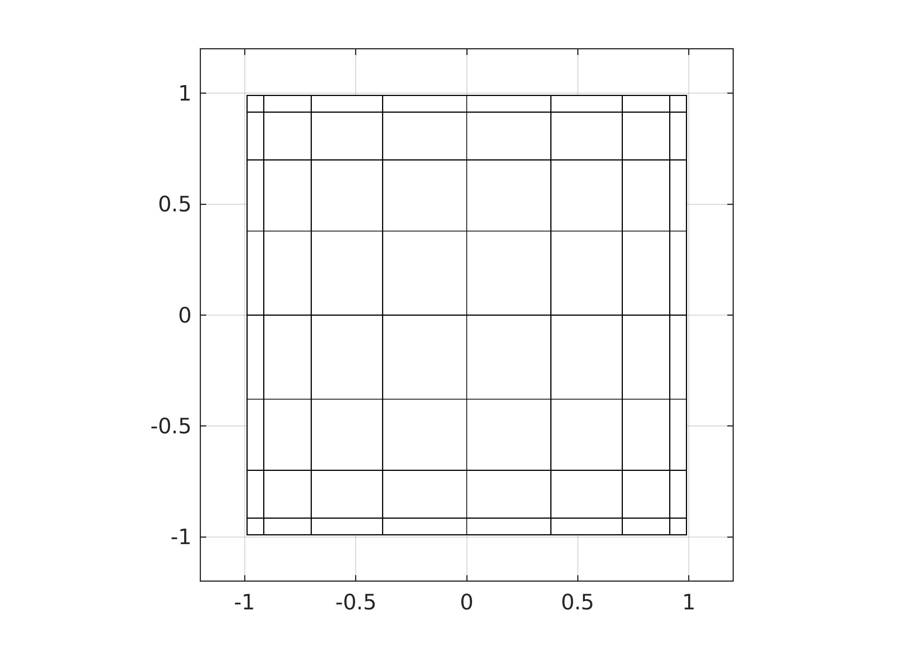
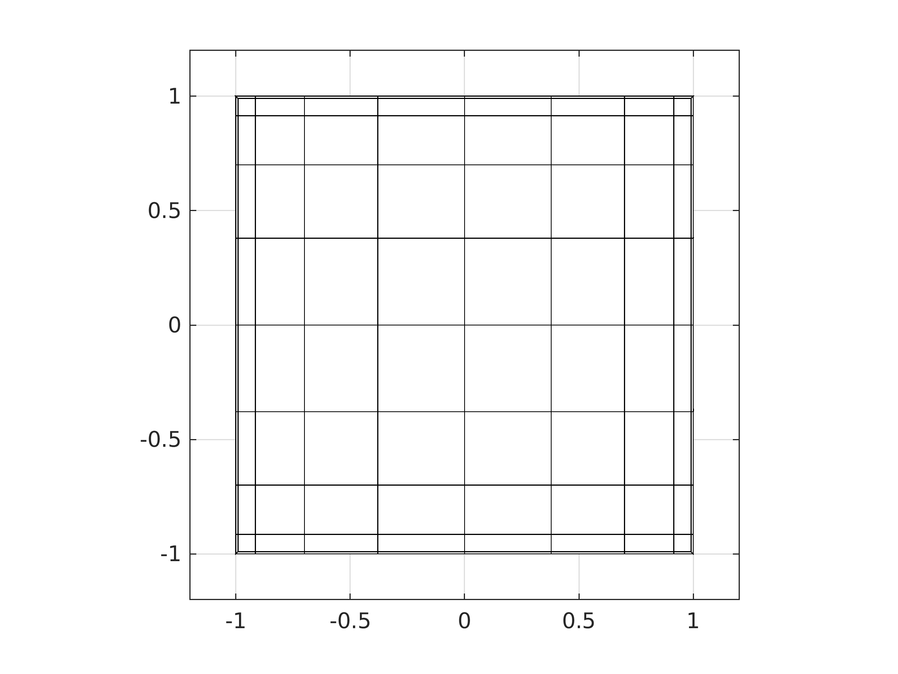
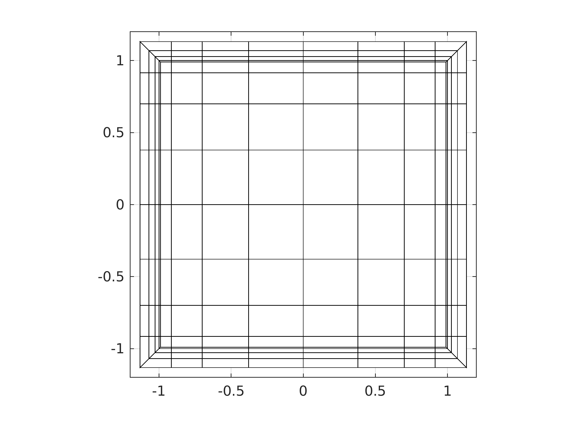

# OneBox

Hex mesh generator for square duct for Nek5000 / NekRS

Features:
- Support CHT
- Can be inspected by prex


## Usage:
```
driver_box2d
```
| Fluid Core | Fluid Box | Solid |
|:---:|:---:|:---:|
|  |  |  |

- box0:  
  Create initial box for the core region of the fluid
- box1:  
  Extrude outward to create boundary layer(s)
- box2:  
  Extrude outward for solid mesh

## TODOS:
- clean up
- argv
- octave
- n2to3
- refactor extrusion, curves and BC
- curves in re2


